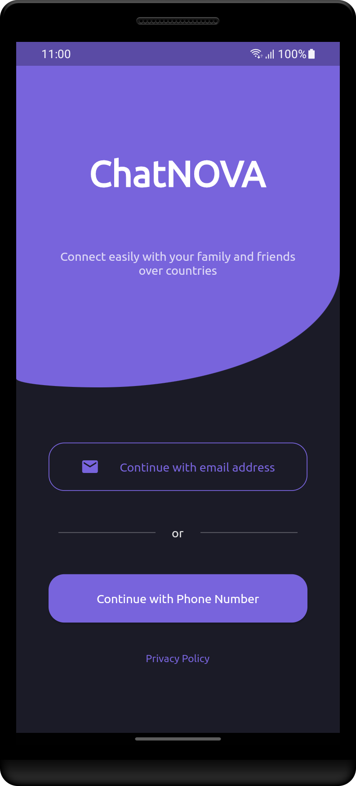

# ChatNova - Instant Messaging Mobile Application

  

ChatNova is an instant messaging mobile application that was developed as a final year project (FYP) using Flutter technology. It allows users to connect with their friends and family through real-time messaging, ensuring a seamless and secure communication experience. It aims to provide a seamless and engaging communication experience for users. One of the key features of ChatNova is the ability to connect and engage in live chats with random users based on their shared interests. This feature adds an element of excitement and serendipity to the user experience. The project aims to design and develop a user-friendly interface that enables real-time messaging.

## Key Features

- **Real-time Messaging**: Users can send and receive instant messages in real time.
- **Friend List Management**: Users can add/remove friend to/from there friend list.
- **Import Contact List**: Users can import friends from there contact list.
- **Block List Management**: Users can block/unblock other users.
- **Live Chat**: Connect and chat with other random users based on their shared interests.
- **User Profile**: Customize your profile with a profile picture, name, and interests/hobbies.
- **Online/Offline Status**: See the online/offline status of your contacts.
- **Firebase as Backend**: Firebase is used to handle user authentication and data.

## App UI Gallery

  
  

  
   

  
  

  
  

  
  

  
  

## Flutter Packages Used

- **provider**
- **firebase_core**
- **firebase_auth**
- **cloud_firestore**
- **firebase_database**
- **firebase_storage**
- **flutter_contacts**
- **image_picker**
- **intl**
- **intl_phone_field**
- **google_fonts**
- **flutter_launcher_icons (dev)**
- **flutter_native_splash (dev)**

## Download and Install

- You can head over to the [Releases Page](https://github.com/JahanzaibZ/ChatNova/releases) to download and install the latest release of the application.

## Installation Instructions

1. Download the <!--appropriate--> APK <!--for your device's architecture--> from the <!--above--> releases section.
2. Enable installation from unknown sources in your device settings if not already enabled.
3. Locate the downloaded APK file on your device.
4. Tap on the APK file to start the installation process.
5. Follow the on-screen prompts to complete the installation.
6. Once installed, launch ChatNova from your device's app drawer.
7. Sign up or log in to start using ChatNova and enjoy instant messaging with your friends.

## Bug/Issue Reports

Please feel free to open issues, feature requests, and pull requests if you have anything worthwhile to add. I appreciate you checking out and using this application.
